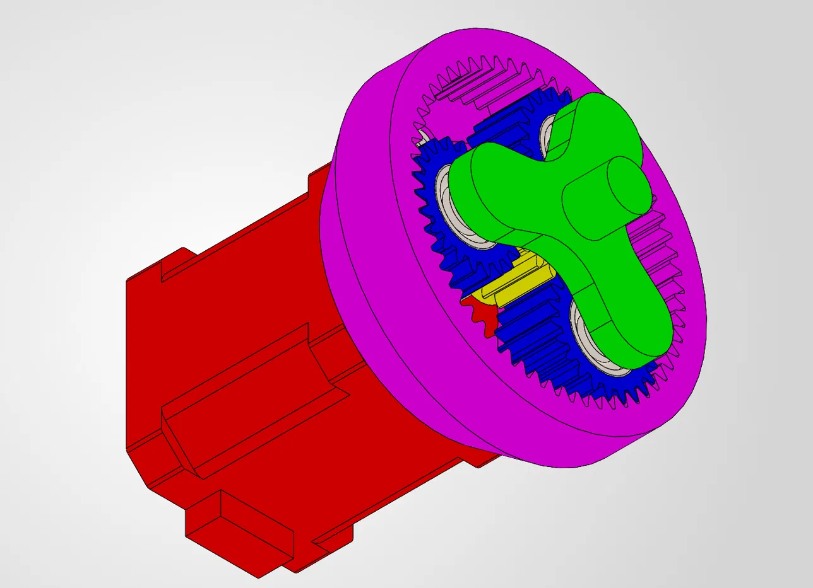

# Planetary Gearbox

3D-printed planetary gearbox for a NEMA17 stepper motor (6-DOF robot arm project).

## Specs (v1)

| Parameter | Value |
|---|---|
| Module | 1 |
| Teeth Sun | 14 |
| Planet | 22 ×3 |
| Ring | 58 |
| Ratio | ~5.14:1 |
| Bearings | 696 2Z |

## Version history

### v1

| Problem | Fix |
|---|---|
| Planet gears sit plastic-on-plastic on their front face, causing high friction under axial load | Add axial (thrust) ball bearings at the contact faces |
| No proper output shaft yet, cover/housing not designed | Design output shaft and cover |

